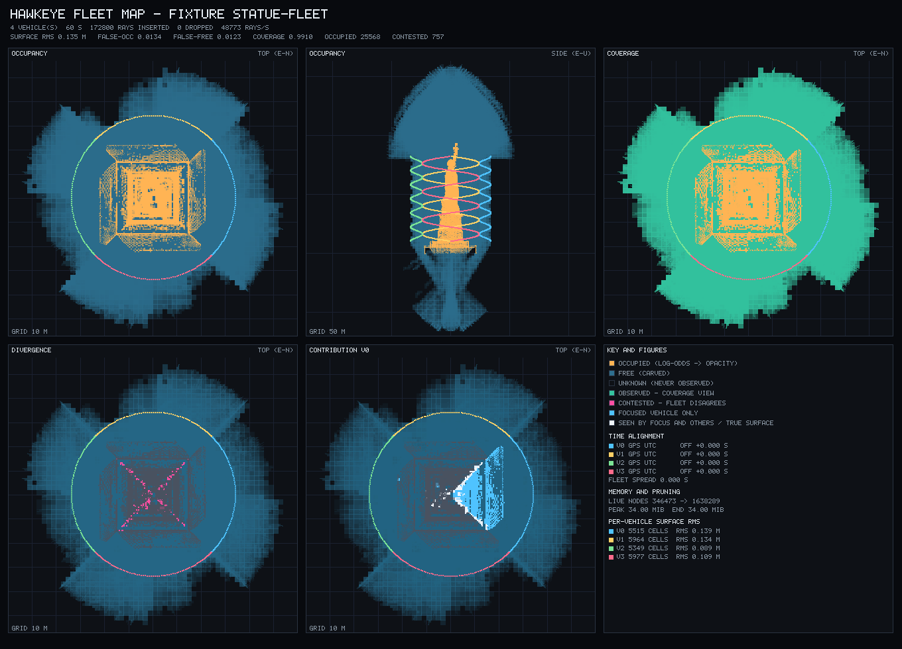
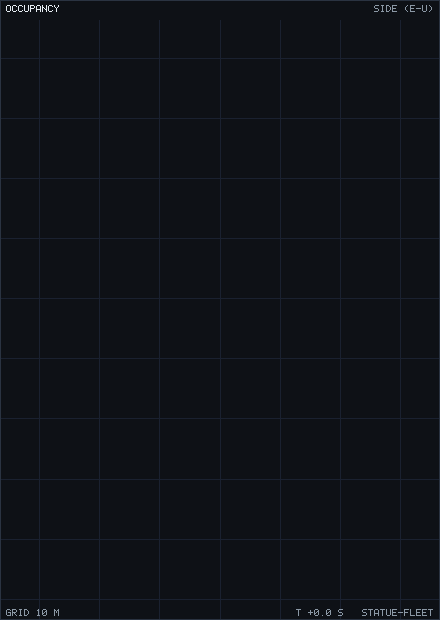

# Mapping an object: the Statue of Liberty fixtures

Every fixture before these ranged against analytic planes. Planes are the right
model for walls and floors and they make the error analysis exact — but they
cannot answer the one question an operator actually asks of a map, which is
*does this look like the thing we flew around*. Every plane looks like every
other plane.

So two fixtures range against a Gaussian splat of the Statue of Liberty
instead, and score the resulting map for shape as well as for error.



## What the world is

`assets/statue_of_liberty.splat` is a 40,000-Gaussian cloud in the standard
32-bytes-per-splat layout (position `f32×3`, scale `f32×3`, colour `u8×4`,
rotation quaternion `u8×4`) that any splat viewer reads. It is 93 m tall — the
real statue including its pedestal — and 43 m across at the star base.

**Provenance, stated plainly:** it is a splat *baked from a mesh*, not a
photogrammetric capture. `tools/bake_splat.py` area-weighted-samples a triangle
mesh and writes one anisotropic Gaussian per sample, flattened along the local
surface normal by 6:1, which is what a splat trained on a solid object
converges to. The source mesh is `statue_of_liberty.obj` from
[leihui6/BENBV](https://github.com/leihui6/BENBV) (MIT). Its shape fidelity is
the mesh's, not a camera's. Regenerate with:

```
tools/bake_splat.py statue_of_liberty.obj assets/statue_of_liberty.splat \
    --height 93 --count 40000
```

`test/splat.c` loads it and ray-casts against the Gaussians: composite front to
back along the ray, and take the depth where accumulated opacity first passes
`SPLAT_SURFACE_ALPHA`. That threshold is 0.25, not the 0.5 of the rendering
convention, and the difference matters — at 0.5 a ray grazing the silhouette
never accumulates half its opacity, comes back a no-return, and the fixture
then carves free space straight through solid statue.

**Nothing about splats reaches the viewer.** `src/` has no idea they exist. The
injector ray-casts against the Gaussians and emits ordinary
`OBSTACLE_DISTANCE` over the wire, so the ingest path under test is the real
one. `no_fixture_symbols` still passes.

## The two fixtures

Both fly the fan on its side: rolling 90° turns `OBSTACLE_DISTANCE`'s
horizontal sweep into a vertical one, so a single orbit paints the statue top
to bottom instead of ringing it at one altitude. Nothing about the message
changes — the frame is still `BODY_FRD` and the viewer resolves it through
attitude, which is precisely the path this exercises. The fan is 72 sectors of
1.7° (`increment_f`, which is why that field is a float), a ~1 m footprint at
the 34 m standoff.

**`statue-solo`** — one drone, four orbits in 120 s while climbing from 10 m to
82 m. It can see every side given time, so its map is expected to resemble the
statue outright.

**`statue-fleet`** — four drones, each pinned to its own 90° sector, each on
its own GPS origin, 60 s. The statue occludes itself, so nothing any of them
does gets them round the back: the partition is enforced by the world, not just
by the flight plan.

## How "resembles the statue" is measured

Surface RMS says every occupied cell is near the object. It does not say the
object is *there* — a map holding one correct cell scores a perfect RMS. So the
map and the world are both voxelised on a 1 m lattice and compared set against
set. The lattice is coarser than the 0.25 m leaf on purpose: below about 0.7 m
the reference cloud's own 0.34 m splat spacing and the sensor's cone footprint
dominate, and a finer lattice would be measuring those rather than the map.

- **recall** — of the voxels an injector ray genuinely terminated in, how many
  does the map hold? The reference is the *observable* envelope rather than the
  whole cloud, because a drone orbiting outside cannot see the underside of the
  base or the inside of the robe, and scoring against surfaces no flight could
  reach would make the metric a statement about the mesh. It is built from the
  injector's rays, not the map's cells, so nothing is circular.
- **precision** — of the map's occupied voxels, how many does the world put
  surface in? Reported strictly, with the within-one-voxel figure beside it;
  the strict one is asserted because a full metre of tolerance saturates at
  1.000 and then says nothing.
- **whole-cloud coverage** — context, including surfaces no orbit can reach.

All three figures are against the exact triangles, not the splat centres — see
the precision section below for why that distinction has teeth.

| | solo | fleet |
| --- | --- | --- |
| surface RMS | 0.331 m | 0.339 m |
| false-occupied | 0.052 | 0.060 |
| false-free | 0.0010 | 0.0026 |
| shape recall | 0.9817 | 0.9812 |
| shape precision (strict / ±1 voxel) | 0.464 / 0.978 | 0.464 / 0.978 |
| shape IoU (strict, 1 m lattice) | 0.420 | 0.424 |
| whole-cloud coverage | 0.816 | 0.830 |
| merged surface | — | 0.9974 |
| best single drone alone | — | 0.350 |

The fleet reaches more of the statue in half the time, and no single drone
accounts for more than 35% of the observed surface. That is the cooperative
claim on a real object rather than on a box.

These are the figures for the **beam** sensor model — carving the cone and
spreading the return across its footprint. An earlier revision of this table
read better on every row (0.243 m RMS, 0.9996 recall, 0.526 strict precision)
and was scored against an injector that reported range along the beam axis
rather than the nearest surface anywhere in the beam, which is not what
`OBSTACLE_DISTANCE` means. Against a faithful injector the same map scores
0.5182 m and 0.8726 — the numbers got worse because the sensor got real, and
the beam model is what brings them back inside thresholds that never moved.
See [fleet-map.md](fleet-map.md#why-the-beam-is-modelled-as-a-beam).

Read the residual honestly: at 0.25 m leaves a 0.33 m RMS is a leaf and a third,
and it is dominated by the footprint spread rather than by scatter — ±1-voxel
precision is 0.978 while strict precision is 0.464, which is the signature of
cells sitting *near* the surface rather than in the wrong place.

## Watching it happen

Four drones, one bay of sky each, sixty seconds — the statue emerging from
nothing but `OBSTACLE_DISTANCE` messages:



Also as h264, at full resolution and 24 fps:
[`statue-fleet-mapping.mp4`](../assets/fleet-map/statue-fleet-mapping.mp4) and
[`statue-solo-mapping.mp4`](../assets/fleet-map/statue-solo-mapping.mp4).

Both are rendered straight from the octree at intervals during replay, so they
need no GPU and no window and are reproducible in CI. `make renders` writes the
GIFs; `make videos` writes full-resolution PNG frames and encodes them, kept
separate because it is the only thing here that needs ffmpeg. By hand:

```
map_checker --tlog statue-fleet.tlog --truth statue-fleet.truth \
    --gif statue-fleet-mapping.gif --gif-interval 1.0 \
    --gif-size 440 620 --gif-view side

map_checker --tlog statue-fleet.tlog --truth statue-fleet.truth \
    --frames frames/ --gif-interval 0.2 --gif-size 720 1000 --gif-view side
ffmpeg -framerate 24 -i frames/frame-%05d.png -c:v libx264 \
    -crf 20 -pix_fmt yuv420p statue-fleet-mapping.mp4
```

The video encodes the PNG frames rather than the GIF, so it is not a re-encode
of a 256-entry palette.

The framing comes from the truth rays' *hit* endpoints, computed before the
first frame. Fitting to the map instead would frame whatever the first second
of flight happened to see and then let the subject grow off the edge; including
no-return endpoints would frame the sensor's reach rather than the thing it was
looking at.

The same run through the actual viewer, captured headless under Xvfb, is in
[`corridor-replay.gif`](../assets/fleet-map/corridor-replay.gif) for the
corridor fixture. On a map the size of the statue the viewer's instanced 3D
view is sparser than the projection above — it draws cubes at LOD with a
24-chunk-per-frame extraction budget and frustum culling, so it is still
working through its backlog while the log plays. The map itself is complete:
`RAYS DROPPED` reads 0 and the checker scores it as tabled above. Worth a
follow-up, and not something to paper over with a prettier recording.

## Centimetres: `statue-precision`

The two fixtures above verify decimetre work, and the reason is a chain in
which every link had to move:

| link | decimetre | centimetre |
| --- | --- | --- |
| beam | 1.7 deg, ~1 m footprint at 34 m | 0.09 deg, 0.6 cm at 8 m |
| standoff | 34 m | 9 m |
| leaf | 0.25 m under a 4096 m root | 7.8 mm under a **256 m** root at depth 15 |
| carve | 1.5 m refined | 0.25 m refined |
| scorer | splat centres, 0.34 m spacing | **exact point-triangle distance** |
| world | Gaussians | **triangles** |

Two of those deserve saying out loud.

**Shrink the root, do not deepen the tree.** A leaf is `root / 2^depth`. A
256 m root reaches 7.8 mm at depth 15 where a 4096 m root needs depth 19 for
the same cell. Depth costs traversal on every query; the root costs nothing.

**The world and the scorer both had to stop being the splat.** A Gaussian's
apparent depth shifts with incidence by roughly its spacing, so ranging against
the cloud puts a floor under the measurable error at about that figure —
measured, 9.65 cm RMS with a 0.6 cm footprint. That floor is the
representation's, not the world's; a real lidar looking at a real statue sees a
hard surface. So `statue-precision` ray-casts against the triangles the splats
were sampled from, and scores against them too. `tools/bake_splat.py --tri`
writes them; `test/trimesh.c` does Möller–Trumbore and exact point-triangle
distance.

**Result: surface RMS 0.0009 m, max error 0.0066 m, false-occupied 0.00000,
false-free 0.0005.** Nine tenths of a millimetre, against an exact reference,
with 99.95% of observed surface represented.

### The erosion bug this fixture found

Accuracy was never the hard part. Completeness was: at first run, **a third of
all observed surface points had no occupied cell within 2 cm**, while surface
RMS was 0.9 mm and false-occupied was 0.00000. That combination is diagnostic
on its own — a map that puts cells in exactly the right place, and then loses
them.

Three plausible fixes were measured, and all three did nothing:

| change | false-free |
| --- | --- |
| baseline | 0.317 |
| hold a cell at the occupancy threshold once it reaches it | 0.316 |
| a cell that has *ever* been hit is immune to free evidence | 0.316 |
| a hit banks credits that later misses spend instead of applying | 0.316 |
| stop each ray's carve 2 / 5 / 10 cm short of its own endpoint | 0.315 / 0.314 / 0.313 |
| **clear stale free evidence when a range return arrives** | **0.0005** |

Instrumenting the failing region explained why. Every hit there was landing on
precisely the right 7.8 mm leaf — the reconstructed endpoints sit within 5 mm
of the injector's own, which is the 1 cm wire quantisation and nothing else —
and every one of them came out of `node_apply` at `-53`. The leaf was already
pinned at the `-70` clamp before its first hit ever arrived, and a single `+17`
return cannot climb out of that.

The misses doing the damage come from rays that never passed through empty
space at all. At 7.8 mm a leaf is routinely *partially* occupied, and a ray at
grazing incidence skims such a leaf for a long way before terminating somewhere
further along; the carve then debits every leaf it clipped. That evidence is
systematically wrong, it is bulky, and it arrives first. Every fix in the first
four rows is a rule about cells that are *already* occupied, so all four arrive
too late to matter — which is why suppressing misses, in three different
flavours, moves the number by 0.001.

Clearing on the hit needs no extra state: a range return zeroes any accumulated
free evidence before its own is applied. It says a present-tense measurement of
a surface outranks any amount of inference drawn from rays that merely passed
nearby. Because it fires only on a hit, an obstacle that is genuinely removed
gets no resets and still carves away to free — `vanishing` still reports zero
cells on removed geometry.

The same change lifts the decimetre fixtures: `statue-solo` goes from 0.0219
false-free to 0.0005 and `statue-fleet` from 0.0123 to 0.0006, shape recall
reaches 1.00000, and the merged-versus-solo split is unchanged — 0.9994 merged
against 0.371 for the best single drone, so completeness did not come from
quietly making every drone see everything. On the twelve plane fixtures nothing
regresses; `disagreement`, which flies a deliberate localisation offset, gets
markedly better (surface RMS 1.245 → 1.054 m, false-free 0.409 → 0.128).

(Those figures are against the axis-range injector this section was written
under. The beam model changes them — see the table at the top — but not the
mechanism or the conclusion.)

**This paragraph originally described the rule as order-independent. It is
not.** It wipes free evidence that arrived *before* a return and does nothing
about the reverse, which is just as physical: a beam terminates in a cell and,
tens of milliseconds later, the neighbouring sectors of the same sweep skim
through it. On a bare cell given one hit and twelve grazing rays, misses-first
leaves log-odds +17 and occupied; hit-first leaves −70 and free, and four
further sweeps never recover it. No statue orbit presents its misses after the
hit, which is why no fixture caught it. A cell cannot tell a grazing pass from a
removed obstacle — both are rays passing through and terminating elsewhere — but
time can: a sweep is over in well under a second, a removal keeps producing
misses indefinitely. A return now shields its cell for `hit_grace_ms` (1 s) and
no longer, which costs a spare bit in `flags` and the `last_seen_ms` already
there. Pinned by `test_grazing_order`.

A TSDF would have prevented this class of bug outright — a ray passing near a
surface writes a positive signed distance rather than "empty", so a zero
crossing survives a grazing pass. **The rest of what this paragraph used to
claim was measured and refuted**: built on one lattice with one traversal
against a binary control grid, the field resolves to cell/6 against the grid's
cell/3.4 — a 1.8x linear gain, not 10x — and matching the shipped map's 3.27 mm
needs ~15 mm voxels, where it holds 6.3x more cells at 374 MiB against 38.3 MiB
rather than 1/125 as many. Do not do the rewrite; the accuracy that would
justify it is available far more cheaply as a sub-voxel offset on occupied
leaves. See [follow-ups.md](follow-ups.md).

Two limits are worth stating because a fixture cannot supply them:

- **Pose.** The injector's poses are exact. A real flight's are not, and at
  this tolerance they are the entire budget: 0.5 deg of attitude error over a
  9 m ray is 8 cm. RTK-fixed position and a short standoff stop being nice to
  have.
- **Extrinsics.** `DISTANCE_SENSOR` carries an orientation and a quaternion but
  no lever arm — there is no field for where on the airframe the sensor sits.
  At 34 m an unmodelled 10 cm offset is noise; at 1 cm it is everything. That
  is a gap in the message, not in the code.

### A performance cliff found on the way

Widening the mapped band from 2.5 m to 7 m puts the map on its byte cap, and
there the same run goes from 3.5 s to over five minutes: prunes fire on every
drain and each walks the whole tree. Worth fixing separately.
