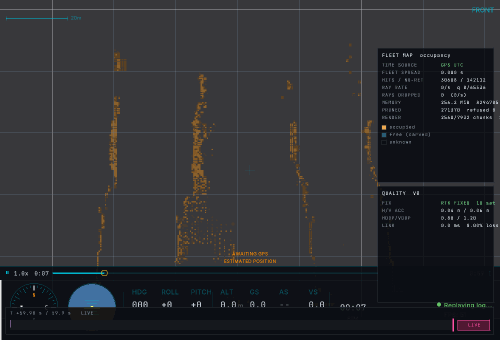

# Mapping an object: the Statue of Liberty fixtures

Every fixture before these ranged against analytic planes. Planes are the right
model for walls and floors and they make the error analysis exact — but they
cannot answer the one question an operator actually asks of a map, which is
*does this look like the thing we flew around*. Every plane looks like every
other plane.

So two fixtures range against a Gaussian splat of the Statue of Liberty
instead, and score the resulting map for shape as well as for error.


## What the world is

`assets/statue_of_liberty.splat` is a 40,000-Gaussian cloud in the standard
32-bytes-per-splat layout (position `f32×3`, scale `f32×3`, colour `u8×4`,
rotation quaternion `u8×4`) that any splat viewer reads. It is 93 m tall — the
real statue including its pedestal — and 43 m across at the star base.

**Provenance, stated plainly:** it is a splat *baked from a mesh*, not a
photogrammetric capture. `tools/bake_splat.py` area-weighted-samples a triangle
mesh and writes one anisotropic Gaussian per sample, flattened along the local
surface normal by 6:1, which is what a splat trained on a solid object
converges to. The source mesh is `statue_of_liberty.obj` from
[leihui6/BENBV](https://github.com/leihui6/BENBV) (MIT). Its shape fidelity is
the mesh's, not a camera's. Regenerate with:

```
tools/bake_splat.py statue_of_liberty.obj assets/statue_of_liberty.splat \
    --height 93 --count 40000
```

`test/splat.c` loads it and ray-casts against the Gaussians: composite front to
back along the ray, and take the depth where accumulated opacity first passes
`SPLAT_SURFACE_ALPHA`. That threshold is 0.25, not the 0.5 of the rendering
convention, and the difference matters — at 0.5 a ray grazing the silhouette
never accumulates half its opacity, comes back a no-return, and the fixture
then carves free space straight through solid statue.

**Nothing about splats reaches the viewer.** `src/` has no idea they exist. The
injector ray-casts against the Gaussians and emits ordinary
`OBSTACLE_DISTANCE` over the wire, so the ingest path under test is the real
one. `no_fixture_symbols` still passes.

## The two fixtures

Both fly the fan on its side: rolling 90° turns `OBSTACLE_DISTANCE`'s
horizontal sweep into a vertical one, so a single orbit paints the statue top
to bottom instead of ringing it at one altitude. Nothing about the message
changes — the frame is still `BODY_FRD` and the viewer resolves it through
attitude, which is precisely the path this exercises. The fan is 72 sectors of
1.7° (`increment_f`, which is why that field is a float), a ~1 m footprint at
the 34 m standoff.

**`statue-solo`** — one drone, four orbits in 120 s while climbing from 10 m to
82 m. It can see every side given time, so its map is expected to resemble the
statue outright.

**`statue-fleet`** — four drones, each pinned to its own 90° sector, each on
its own GPS origin, 60 s. The statue occludes itself, so nothing any of them
does gets them round the back: the partition is enforced by the world, not just
by the flight plan.

## How "resembles the statue" is measured

Surface RMS says every occupied cell is near the object. It does not say the
object is *there* — a map holding one correct cell scores a perfect RMS. So the
map and the world are both voxelised on a 1 m lattice and compared set against
set. The lattice is coarser than the 0.25 m leaf on purpose: below about 0.7 m
the reference cloud's own 0.34 m splat spacing and the sensor's cone footprint
dominate, and a finer lattice would be measuring those rather than the map.

- **recall** — of the voxels an injector ray genuinely terminated in, how many
  does the map hold? The reference is the *observable* envelope rather than the
  whole cloud, because a drone orbiting outside cannot see the underside of the
  base or the inside of the robe, and scoring against surfaces no flight could
  reach would make the metric a statement about the mesh. It is built from the
  injector's rays, not the map's cells, so nothing is circular.
- **precision** — of the map's occupied voxels, how many does the world put
  surface in? Reported strictly, with the within-one-voxel figure beside it;
  the strict one is asserted because a full metre of tolerance saturates at
  1.000 and then says nothing.
- **whole-cloud coverage** — context, including surfaces no orbit can reach.

All three figures are against the exact triangles, not the splat centres — see
the precision section below for why that distinction has teeth.

| | solo | fleet |
| --- | --- | --- |
| surface RMS | 0.221 m | 0.268 m |
| false-occupied | 0.035 | 0.056 |
| shape recall | 0.899 | 0.950 |
| shape precision (strict / ±1 voxel) | 0.584 / 0.997 | 0.568 / 0.996 |
| whole-cloud coverage | 0.707 | 0.830 |
| merged surface | — | 0.911 |
| best single drone alone | — | 0.346 |

The fleet reaches more of the statue in half the time (0.830 of the whole cloud
against 0.707), and no single drone accounts for more than a third of the
observed surface. That is the cooperative
claim on a real object rather than on a box.

## Watching it happen

`statue-fleet` replayed through the viewer, front orthographic, free space
hidden, captured headless under Xvfb:



```
xvfb-run -s "-screen 0 1000x680x24" hawkeye \
    --tlog statue-fleet.tlog --view front --view-span 110 \
    --map-hide-free --capture-gif build.gif --capture-fps 1.6 --exit-after 60
```

The viewer's instanced 3D view is sparser than the checker's orthographic
projection of the same map: it draws cubes at LOD with a per-frame extraction
budget of 24 chunks and frustum culling, so on a map this size it is still
working through its backlog while the log plays. The map itself is complete —
`RAYS DROPPED` reads 0 and the checker scores it as above.

## Centimetres: `statue-precision`

The two fixtures above verify decimetre work, and the reason is a chain in
which every link had to move:

| link | decimetre | centimetre |
| --- | --- | --- |
| beam | 1.7 deg, ~1 m footprint at 34 m | 0.09 deg, 0.6 cm at 8 m |
| standoff | 34 m | 9 m |
| leaf | 0.25 m under a 4096 m root | 7.8 mm under a **256 m** root at depth 15 |
| carve | 1.5 m refined | 0.25 m refined |
| scorer | splat centres, 0.34 m spacing | **exact point-triangle distance** |
| world | Gaussians | **triangles** |

Two of those deserve saying out loud.

**Shrink the root, do not deepen the tree.** A leaf is `root / 2^depth`. A
256 m root reaches 7.8 mm at depth 15 where a 4096 m root needs depth 19 for
the same cell. Depth costs traversal on every query; the root costs nothing.

**The world and the scorer both had to stop being the splat.** A Gaussian's
apparent depth shifts with incidence by roughly its spacing, so ranging against
the cloud puts a floor under the measurable error at about that figure —
measured, 9.65 cm RMS with a 0.6 cm footprint. That floor is the
representation's, not the world's; a real lidar looking at a real statue sees a
hard surface. So `statue-precision` ray-casts against the triangles the splats
were sampled from, and scores against them too. `tools/bake_splat.py --tri`
writes them; `test/trimesh.c` does Möller–Trumbore and exact point-triangle
distance.

**Result: surface RMS 0.0008 m, max error 0.0052 m, false-occupied 0.00000.**
Eight tenths of a millimetre, against an exact reference.

### What it does not achieve, and why

Completeness at that resolution is worse: about half the observed surface
points have no occupied cell within 2 cm. That is not quantisation — widening
the tolerance from one leaf to 2 cm moved it by two points. It is **erosion**.
At 7.8 mm a ray grazing the surface carves cells a neighbouring ray marked, and
occupied cells end up at mean |log-odds| 18 against a threshold of 14, barely
holding on.

Binary occupancy has no way to say "the surface passes through this cell, at
this offset". A surfel centroid (a running mean of hit endpoints per leaf) or a
TSDF (signed distance and weight, with the surface at the interpolated zero
crossing) does, and a 5 cm TSDF resolves a surface to roughly voxel/10 at 1/125
the cell count of a 1 cm binary grid. That is the next step and is not in this
change.

Two other limits are worth stating because a fixture cannot supply them:

- **Pose.** The injector's poses are exact. A real flight's are not, and at
  this tolerance they are the entire budget: 0.5 deg of attitude error over a
  9 m ray is 8 cm. RTK-fixed position and a short standoff stop being nice to
  have.
- **Extrinsics.** `DISTANCE_SENSOR` carries an orientation and a quaternion but
  no lever arm — there is no field for where on the airframe the sensor sits.
  At 34 m an unmodelled 10 cm offset is noise; at 1 cm it is everything. That
  is a gap in the message, not in the code.

### A performance cliff found on the way

Widening the mapped band from 2.5 m to 7 m puts the map on its byte cap, and
there the same run goes from 3.5 s to over five minutes: prunes fire on every
drain and each walks the whole tree. Worth fixing separately.
